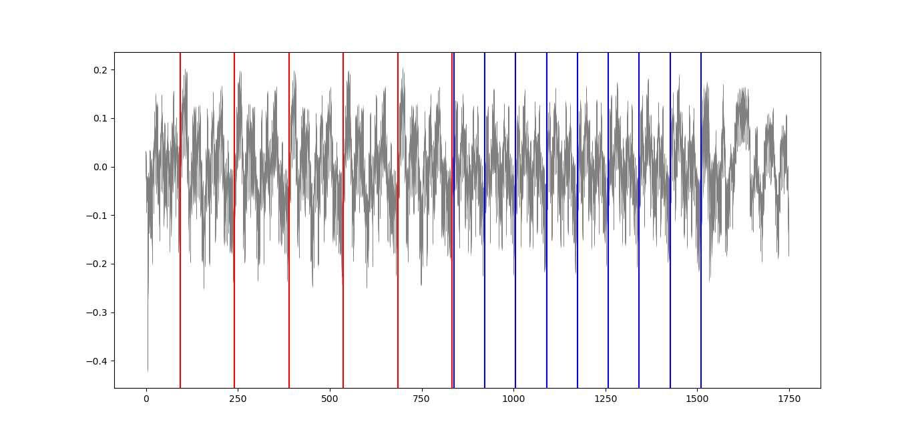

# HawkPowerAnalysis

The goal of this project is to perform Power Analysis on the [Hawk signature scheme](https://hawk-sign.info/). The Hawk implementation is the official one taken from [here](https://github.com/hawk-sign/dev/). The targeted algorithm from the specification is SamplerSign, and the corresponding code is the function [sig_gauss](https://github.com/hawk-sign/dev/blob/main/src/hawk_sign.c#L641). The traces have been generated with a ChipWhispererLite with STM32F3 target (ARM Cortex M4). Two attacks are performed in this work: a non-profiled analysis and a template attack.

*Power consumption during execution of SamplerSign. Red and blue
lines correspond respectively to the iterations of the first and second for-loops.*

## Content

### data

Traces generated with the reference implementation:
- `traces_hawk1024_10000.npy`: 10,000 traces generated with the reference implementation (used to perform the non-profiled attack & to build the template)
- `x_hawk1024_10000.npy`: coefficients of x corresponding to the traces in `traces_hawk1024_10000.npy`  
- `traces_haw1024_new.npy`: 1,000 other traces (used to perform the template attack)
- `x_hawk1024_new.npy`: coefficients of x corresponding to the traces in `traces_hawk1024_new.npy`

Traces generated after application of our countermeasures:
- `traces_hawk1024_10000_CM.npy`: 10,000 traces generated after application of our countermeasures
- `x_hawk1024_10000_CM.npy`: coefficients of x corresponding to the traces in `traces_hawk1024_10000_CM.npy`

### scripts

- `non_profiled_analysis.ipynb`: jupyter notebook containing the code used to run the non-profiled analysis  
- `template_attack.ipynb`: jupyter notebook containing the code used to run the template attack  

### chipwhisperer

This folder contains the files necessary to regenerate the traces from a ChipWhisperer (assuming that all the required software has been previously installed, see official [ChipWhisperer documentation](https://chipwhisperer.readthedocs.io/)).

## Reference

TBD